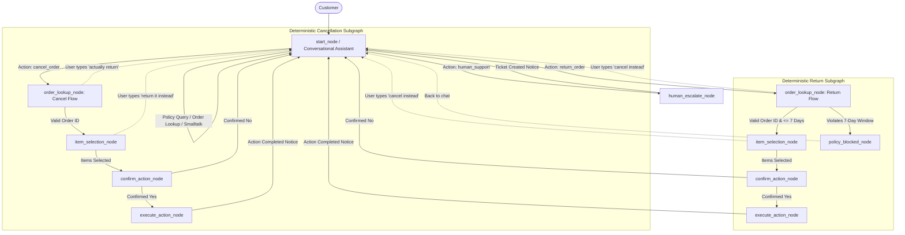

### Code Quality & Implementation Style

* Keep the implementation **simple, precise, readable, and maintainable**.
* Do not over-engineer or introduce unnecessary abstractions, classes, utilities, or frameworks.
* Prefer **small, focused functions** with clear names and responsibilities.
* Avoid both extremes: **do not write overly complex code, but also do not make the implementation unnecessarily loose or scattered**.
* Reuse existing project patterns and utilities wherever possible instead of creating parallel implementations.
* Keep the code easy for another developer to read and modify.
* Add comments only where the logic is non-obvious; do not comment every line.
* Before adding a new abstraction, check whether a simple existing function or pattern is sufficient.
* **Prioritize correctness and clarity over cleverness.**
* Make the **smallest clean change** required to implement the plan without unnecessarily refactoring unrelated code.


# Architectural Plan: Conversational AI Agent with Mid-Flow Intent Switching & Deterministic Subgraphs

# Use the project's existing architecture where possible.

# After inspection, make the smallest coherent set of changes required for this architecture.

# Replace the old separate entry/menu/FAQ routing architecture with one conversational front door.

Call it: open_router_node
If the existing project uses another naming convention, follow the existing convention rather than unnecessarily renaming files.

The front door must handle:

policy / FAQ questions
order-status questions
cancel intent
return intent
human-support intent
order ID extraction
ambiguous requests

Examples:

"Cancel ORD-15"
→ cancellation flow immediately

"I want to return ORD-15"
→ return flow immediately

"What is your return policy?"
→ answer and remain in conversational front door

"I need an agent"
→ human escalation

Do not ask for confirmation merely to route a clearly understood request.

Confirmation is still required before transactional execution.

8. Do Not Let False Positives Hijack the Flow

Intent switching must only happen when the current input is not valid for the current node.

For example, if an item/order input is expected and valid, process it first.

Do not switch because a legitimate value happens to contain a keyword.

The expected-input check has priority over intent-switch detection.

# IMPORVE STATE REQUIRED FOR THE PROJECT  Add Explicit Flow State  

16. Keep Existing Frontend Contract

Do not unnecessarily change the frontend.

Preserve the existing concepts for:

message
options
status
thread_id

Buttons should continue to work.

The frontend should not need to understand internal LangGraph details such as:

START
END
conditional_edges
Command
checkpointer
internal node names
## Executive Summary
This document defines the production architecture for the TechGear Customer Support AI Agent. We replace the rigid initial menu with a **modern conversational front door** while keeping financial, cancellation, and return operations **100% deterministic and safe in Python**. 

Crucially, this design introduces a **zero-cost layered intent-switching mechanism** that prevents "state traps"—allowing customers to change their mind mid-workflow (e.g., switching from cancel to return, or asking a policy question) with natural conversational transitions and zero LLM latency overhead on the happy path.

---

## 1. Core Architectural Principles

1. **Conversational Front Door (No Initial IVR Menu)**:
   - The user starts with an open, friendly greeting: *"Hi! How can I help you today?"*
   - Free-form natural language input: Users can ask questions, state order IDs, or command actions directly.
   - Eliminates the redundant separate menu node (`entry_node`) and merges it into an intelligent front-door assistant (`start_node`).

2. **Deterministic Safety for State-Changing Operations**:
- OUR ALREDY EXISTING NODESS KEEP THEM AS IT IS
   - Money and database operations (order cancellation, returns, item selection, and refunds) are **never executed by an LLM**.
   - They execute strictly in deterministic Python nodes: order validation, 7-day policy window checks, 5-point doorstep QC notices, and explicit confirmation prompts.
   - Interactive UI options (compact buttons, item selection pills) appear **only once inside the deterministic workflow** for safety and precision.

3. **Layered, Zero-Cost Mid-Flow Intent Switching**:
   - If a user types free text instead of clicking a button while inside a flow (e.g., typing *"actually I want to return it"* while in the cancel flow), the system immediately detects the intent switch.
   - Emits a brief, natural AI transition message (*"Sure, let's switch to returning your order instead!"*).
   - Fast-path checks (expected inputs & regex) ensure **0ms latency and 0 API cost** on normal button clicks. The LLM classifier is only called as a fallback for truly ambiguous text.

---
# KEEP THIS LOGIC DONT REMOVE
Your original graph had order_lookup_node → retry → retry_exhausted_node. This diagram only shows "Valid Order ID" → ItemSelect, no edge for "invalid ID, try again" or "3 orders found, disambiguate." That logic still needs to exist

ither draw it back in, or if it's folded silently inside order_lookup_node as internal state (not a separate graph node), say so explicitly. Right now the diagram implies it just doesn't exist anymore.

# ADD THIS THIS LET OPEN THAT NODE PolicyBlocked only has "back to chat" — no escalate option.
Your original graph had route_blocked_choice offering both human_escalate and start. This diagram shows only one exit. If someone's return is blocked (past 7-day window) and they want to argue it or escalate, this diagram has no path for that anymore.

## 2. Target Graph Topology



---

## 3. Node Responsibilities & Logic Breakdown

### 3.1 `start_node` (The Conversational Front Door)
- **Primary Function**: Greets user, answers policy/warranty/delivery FAQs using the KV-cached system prompt, performs order status lookups via `tools.py`, and detects action intents.
- **Tools**:
  - `get_recent_orders()`: Fetches customer's orders from PostgreSQL.
  - `get_order_details(order_id)`: Fetches items, delivery date, status.
  - `signal_intent(intent, order_id)`: Flags clear action requests (`cancel_order`, `return_order`, `human_support`).
- **Routing**:
  - If question/FAQ: Responds conversationally and stays in `start_node`.
  - If action detected: Silently extracts `order_id` (if mentioned) and routes immediately to `order_lookup_node` with `action_type = "cancel_order"` or `"return_order"`.

---

### 3.2 Deterministic Action Subgraphs (`order_lookup` -> `confirm` -> `execute`)
- **`order_lookup_node`**:
  - If `order_id` is already in state (extracted by `start_node`), validates immediately.
  - If missing, prompts customer to select from their recent eligible orders (or enter `ORD-XX`).
  - Strict policy check: For returns, validates `delivery_date <= 7 days` (strict 7-day rule). If violated, routes to `policy_blocked_node`.
- **`item_selection_node`**:
  - Displays interactive item options/checkboxes with prices and quantities.
- **`confirm_action_node`**:
  - Shows explicit financial summary (refund calculation, payment method settlement SLA 4–7 business days).
  - Prompts with two explicit buttons: `[ ✅ Confirm ]` or `[ 🔙 Cancel & Return to Chat ]`.
- **`execute_action_node`**:
  - Performs atomic SQL transaction updating status to `Cancelled` or `Return Requested`.
  - Emits success message and routes cleanly back to `start_node`.

---

## 4. Layered Intent Switching (Preventing State Traps)

### The Problem
If a customer is prompted to *"Select which items to cancel:"* and types:
> *"Wait, I don't want to cancel, I want to return order ORD-12"* or *"What is your return policy?"*

A naive node treats this as an invalid item selection, repeats the prompt, and traps the user until they give up or reset.

### The Solution: 3-Tier Layered Intent Checker
Every deterministic node that accepts text input runs a lightweight shared function `check_intent_switch()`:

```
Customer Input Received
          │
          ▼
┌─────────────────────────────────────────────────────────────┐
│ TIER 1: Expected Input Fast-Path (0ms, 0 Cost)             │
│ • Is it a known button click? ('yes', 'no', '1', '2', 'all')│
│ • Is it a pure order ID? ('ORD-15', '15')                   │
└──────────────┬──────────────────────────────────────────────┘
               │ Matches expected?
       ┌───────┴───────┐
      YES              NO
       │               │
       ▼               ▼
[Run Normal     ┌─────────────────────────────────────────────┐
 Node Logic]    │ TIER 2: Fast Keyword & Regex Check (0ms)    │
                │ • Cancel phrases: 'cancel', 'stop order'    │
                │ • Return phrases: 'return', 'damaged', etc. │
                │ • Support phrases: 'human', 'agent', 'help' │
                │ • Policy phrases: 'policy', 'how many days' │
                └──────────────┬──────────────────────────────┘
                               │ Matches intent switch?
                       ┌───────┴───────┐
                      YES              NO
                       │               │
                       ▼               ▼
                [Intent Switch  ┌─────────────────────────────┐
                 Triggered!]    │ TIER 3: LLM Intent Fallback │
                                │ (Only for ambiguous text)   │
                                └─────────────────────────────┘
```

### Transition AI Message
When an intent switch occurs, the agent sets a natural transition notice in `messages`:
- Switching from Cancel to Return:
  > *"Got it! Let's switch to returning your items instead."*
- Asking a question while in a workflow:
  > *"Sure, let me answer your question first."*

---

### 4.3 State Cleanup on Workflow Switch (`clear_flow_state`)
When switching workflows (e.g. `cancel` → `return`), all flow-specific state from the previous workflow must be cleared to prevent cross-flow data contamination.

- **Clear:**
  - `items`
  - `refund_amount`
  - `selected_summary`
  - `order_id_retry_count`
  - flow-specific context flags
- **Preserve:**
  - `user_id`
  - `messages`
- **Order ID Rule:**
  - Preserve the existing `order_id` by default so the user doesn't have to re-type it.
  - Replace `order_id` only if the user's new message explicitly specifies another order (e.g., *"actually return ORD-12"*).

Implementation is centralized in one shared helper:
```python
def clear_flow_state(state: dict, new_order_id: Optional[str] = None) -> dict:
    ...
```

---

### 4.4 FAQ Read-Only Interruption & Smart Resume (`resume_node`)
When a user asks a read-only policy or FAQ question in the middle of a deterministic workflow (e.g. while selecting items to return):

```
Current deterministic node (e.g., item_selection_node)
       │
       ▼ (User asks: "How long does the refund take?")
open_router_node (Answers: "Refunds take 4–7 business days.")
       │
       ▼ (Smart Resume via state["resume_node"])
Resume item_selection_node (Previously selected items remain intact!)
```

1. Before routing to answer the FAQ, record: `state["resume_node"] = current_node`.
2. After answering the question, route back to `resume_node` and reset `state["resume_node"] = None`.
3. The user's progress and selected items are preserved seamlessly.

---

## 5. Implementation Roadmap
 
### Phase 1: Intent-Switching & State Cleanup Utilities (`intent_router.py`)
- Create `check_intent_switch(user_input: str, current_flow: str) -> Optional[dict]`.
- Implements Tier 1 (expected inputs), Tier 2 (regex/keyword patterns), and Tier 3 (fast LLM classification fallback).
- Create `clear_flow_state(state, new_order_id)`.

### Phase 2: Unify Front Door in `nodes.py` & `graph.py`
- Refactor `entry_node` and `faq_node` into a single, unified `open_router_node` (or `start_node`).
- Set `graph.set_entry_point("start_node")`.
- Remove dead menu-retry and menu-choice fields from `CustomerState`.
- Retain KV-cache optimization (`load_policy_files()` with `@lru_cache`).

### Phase 3: Wire Intent Switchers & Smart Resume into Deterministic Nodes
- At the top of `order_lookup_node`, `item_selection_node`, `confirm_action_node`, and `policy_blocked_node`:
  - Run expected-input validation first.
  - If unexpected free text, run `check_intent_switch()`.
  - For workflow replacement: clear flow state via `clear_flow_state()` and transition with an AI transition notice.
  - For read-only FAQ questions: record `resume_node` and answer without clearing progress.

### Phase 4: Verification & Automated Integration Tests
Verify the complete safety matrix:
- [ ] `retry_exhausted_node` still works when order is not found after 3 attempts.
- [ ] `policy_blocked_node` → return to chat works.
- [ ] `policy_blocked_node` → human escalation ticket works.
- [ ] Cancel → Return switching cleanly clears cancel-specific state (`items`, `refund_amount`).
- [ ] `order_id` is preserved by default or replaced if a new order ID is given.
- [ ] FAQ query mid-flow answers accurately and resumes previous node (`resume_node`).
- [ ] Selected items and checkboxes are not lost during FAQ interruption.
- [ ] Zero additional LLM calls on deterministic button clicks (0 cost / negligible local latency).
- [ ] All existing automated tests continue to pass.

---

## 6. Performance, Cost & Latency Guarantees

1. **Happy Path Latency**:
   - Button clicks & valid order IDs skip Tier 2 and Tier 3 completely -> **0.00ms routing overhead**.
2. **Token Economy**:
   - System prompt utilizes KV caching on Groq/LLM provider.
   - Zero LLM calls for structured stepper turns.
3. **Deterministic Safety**:
   - Database mutations (`execute_action_node`) and policy eligibility rules remain 100% hard-coded in Python.

The key principle is:

LLM for understanding.
Graph for orchestration.
Python for business rules.
Database for state-changing execution.

Make the changes in the existing project, keep the implementation focused, and do not introduce unnecessary abstractions.