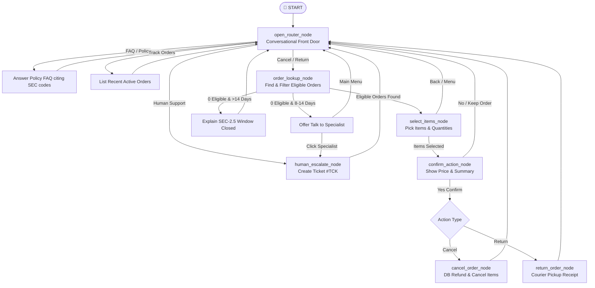

# TechGear Customer Support AI Agent — Architecture & Project Flow

> **Don't panic!** This codebase is built around **one simple idea**:
> It is a state machine (LangGraph) where a customer moves from screen to screen (Nodes), making choices through buttons or free text, guided by smart guardrails and store policies.

---

## 1. Visual Flowchart & Tree Diagram

### ASCII Tree Diagram
```text
                                  START
                                    │
                                    ▼
                         ┌────────────────────┐
                         │  open_router_node  │  (Conversational Front Door)
                         └─────────┬──────────┘
                                   │
      ┌──────────────┬─────────────┼──────────────┬───────────────┐
      ▼              ▼             ▼              ▼               ▼
 [Policy FAQ]   [Track Order] [Cancel Order] [Return Order]  [Human Support]
   (Answer &      (List recent     │              │               │
    Re-prompt)     orders)         ▼              ▼               ▼
                               ┌──────────────────────┐  ┌──────────────────┐
                               │  order_lookup_node   │  │human_escalate_node│
                               └──────────┬───────────┘  └────────┬─────────┘
                                          │                       │
                                    Eligible Orders?              ▼
                                     /          \             Create Ticket
                                   YES           NO            (#TCK-...)
                                   /              \               │
                                  ▼                ▼              ▼
                     ┌──────────────────┐    ┌─────────────────┐ Main Menu
                     │select_items_node │    │ Anti-Spam Gate  │
                     └────────┬─────────┘    │ 8-14d: Escalate │
                              │              │ >14d:  Reject   │
                              ▼              └─────────────────┘
                     ┌──────────────────┐
                     │confirm_action_node│  (Strict 0.95 Confidence Floor)
                     └────────┬─────────┘
                              │
                         Confirmed?
                          /        \
                        YES         NO / Abort
                        /             \
                       ▼               ▼
               ┌───────────────┐   Reset to Main Menu
               │ Execute DB Op │
               └───────┬───────┘
                       │
              ┌────────┴────────┐
              ▼                 ▼
     cancel_order_node   return_order_node
      (Database Update)   (Pickup Receipt)
              │                 │
              └────────┬────────┘
                       ▼
             Post-Action Main Menu
```

### Interactive Mermaid Flowchart


---

## 2. High-Level Architecture: How the Whole App Connects

The project is organized in 3 clean layers:

```text
[ Frontend: Streamlit ]          src/frontend/app.py
          │
          │ HTTP REST API (port 8000)
          ▼
[ Backend API: FastAPI ]         src/backend/main.py & helper.py
          │
          │ MemorySaver Checkpointed Graph
          ▼
[ AI Agent Core: LangGraph ]     src/customer_support_ai_agent/
          │
          │ PostgreSQL Connection Pool
          ▼
[ Database: Supabase / PG ]      orders, order_items, customers, tickets
```

1. **User interacts in the browser** ([app.py](file:///d:/Customer-Support-AI-Agent/src/frontend/app.py)): Clicks a button or types text.
2. **Backend receives the turn** ([main.py](file:///d:/Customer-Support-AI-Agent/src/backend/main.py) & [helper.py](file:///d:/Customer-Support-AI-Agent/src/backend/helper.py)): Calls `execute_agent_turn(user_id, user_message, thread_id)`.
3. **LangGraph runs until it hits an `interrupt`**: It pauses, packages the UI prompt and button options, and sends it back to the browser.
4. **User answers**: Graph resumes from the exact paused node.

---

## 3. File-by-File Breakdown (`src/customer_support_ai_agent/`)

Here is what every single file in the package does:

| File | Core Responsibility | Why It Exists |
|---|---|---|
| [state.py](file:///d:/Customer-Support-AI-Agent/src/customer_support_ai_agent/state.py) | **The Memory Sheet** (`CustomerState`) | Holds the 8 variables tracked throughout the chat (`user_id`, `order_id`, `action_type`, `customer_details`, `retry_count`, `confirmed`, `context`, `messages`). |
| [graph.py](file:///d:/Customer-Support-AI-Agent/src/customer_support_ai_agent/graph.py) | **The Assembly Line** (`StateGraph`) | Registers the 8 nodes and connects them with edges and conditional routing logic. |
| [nodes.py](file:///d:/Customer-Support-AI-Agent/src/customer_support_ai_agent/nodes.py) | **The Workers** (Node Functions) | Where the actual work happens: prompt presentation, button detection, DB lookup, AI replies, and cancellation execution. |
| [routes.py](file:///d:/Customer-Support-AI-Agent/src/customer_support_ai_agent/routes.py) | **The Traffic Lights** (Routing Functions) | Reads the current `state` and decides which node to execute next (e.g., if confirmed, go to `cancel_order_node`; if menu, go to `start_node`). |
| [intent_router.py](file:///d:/Customer-Support-AI-Agent/src/customer_support_ai_agent/intent_router.py) | **Fast-Path & AI Brain** | `is_button_signal()` detects button clicks in 0ms (0 AI cost). `classify_user_intent()` uses a single KV-cached LLM call for FAQs and routing. `classify_confirmation()` strictly guards final confirmations. |
| [ui_payloads.py](file:///d:/Customer-Support-AI-Agent/src/customer_support_ai_agent/ui_payloads.py) | **The Presentation Layer** | Formats clean markdown prompts, button option lists, order cards, item selection checkboxes, and receipts. |
| [prompts.py](file:///d:/Customer-Support-AI-Agent/src/customer_support_ai_agent/prompts.py) | **The Knowledge & Rules** | Holds `UNIFIED_SYSTEM_PROMPT` containing all store policies (`[SEC-1.0]` to `[SEC-5.0]`) and intent routing instructions. |
| [db_functions.py](file:///d:/Customer-Support-AI-Agent/src/customer_support_ai_agent/db_functions.py) | **Database Queries** | Raw SQL queries for fetching order history, getting items, cancelling orders, updating inventory, and logging tickets. |
| [schemas.py](file:///d:/Customer-Support-AI-Agent/src/customer_support_ai_agent/schemas.py) | **Pydantic Types** | Defines structured outputs for the LLM (e.g., `ActionConfirmationClassifier`). |
| [model.py](file:///d:/Customer-Support-AI-Agent/src/customer_support_ai_agent/model.py) | **LLM Client** | Initializes `ChatGroq(model="openai/gpt-oss-120b", temperature=0)`. |
| [tools.py](file:///d:/Customer-Support-AI-Agent/src/customer_support_ai_agent/tools.py) | **LangChain Tools** | Injected state tools (`get_recent_orders`, `get_order_details`). |

---

## 4. Deep-Dive: The 8 Nodes in `nodes.py`

Every node is just a Python function that takes `state: CustomerState` and returns a `dict` updating the state.

### Node 1: `open_router_node` (The Front Door / `start_node`)
* **What it does:** Displays the greeting or post-action menu.
* **Input Handling:**
  * If user clicked a button (`"menu"`, `"ticket"`), handles it in 0ms with zero AI.
  * If user clicked `"remaining orders"`, fetches active orders and replies in 0ms.
  * If user typed text, calls `classify_user_intent(raw_input)`.
    * If FAQ: replies with policy markdown citing `[SEC-...]`.
    * If cancel/return: sets `action_type="cancel_order"` (or `return_order`) and moves forward.
    * If tracking: shows recent orders.
    * If human: transitions to `human_escalate_node`.

### Node 2: `order_lookup_node` (Finding the Order)
* **What it does:** Lists eligible orders.
  * Cancel eligible: `Placed`, `Processing`, `Partially_Cancelled`.
  * Return eligible: `Delivered` within **7 days** (`RETURN_WINDOW_DAYS = 7`).
* **Smart Guardrails:**
  * **0 Eligible Orders (Turn 1):** Shows message + only `[🏠 Main Menu]` (No specialist button to prevent spam).
  * **Borderline Pushback (Turn 2):** If user mentions 8–14 days, explains policy and unlocks `[💬 Talk to Specialist]`.
  * **Ancient Orders (>14 days):** Explains window is closed; keeps specialist button hidden.
  * **1 Eligible Order:** Auto-prompts `[✅ Yes, Cancel ORD-X]`.
  * **Order ID entered:** Verifies order exists in customer account and moves to item selection.

### Node 3: `select_items_node` (Choosing Items & Quantities)
* **What it does:** Generates the item selection form.
* **User Options:**
  * Select partial items via checkboxes and quantities.
  * Or click `[❌ Cancel Whole Order]` / `[all]`.
* **Zero AI Cost:** Reads checkbox values or `"all"` directly from the UI payload with 0 LLM calls.

### Node 4: `confirm_action_node` (The Safety Gate)
* **What it does:** Calculates total refund, summarizes selected items, and asks for confirmation.
* **Strict Confirmation Rule:**
  * Button clicks (`"confirm"`, `"abort"`) are handled in 0ms.
  * Free text is sent to `classify_confirmation()` which requires a **0.95 confidence score**. Hesitations like *"maybe"*, *"I think so"*, or *"not sure"* are rejected.

### Node 5: `cancel_order_node` (Execute Cancellation)
* **What it does:** Calls database functions to:
  1. Cancel selected order items.
  2. If all items cancelled, marks order as `Cancelled`. If some items remain, marks `Partially_Cancelled`.
  3. Restores product inventory in DB.
  4. Returns a receipt with total refund amount and timeline `[SEC-4.0]`.

### Node 6: `return_order_node` (Execute Return)
* **What it does:** Marks items as `Return_Requested` and generates a pickup receipt with doorstep QC rules `[SEC-3.0]`.

### Node 7: `policy_blocked_node` (Ineligible Order Notice)
* **What it does:** If an order cannot be processed (e.g., trying to cancel an already shipped order), clearly explains the specific policy section and offers options to return to menu or talk to support.

### Node 8: `human_escalate_node` (Human Support)
* **What it does:** Calls `create_support_ticket()` in DB and generates a ticket ID (`#TCK-{user_id}-{random}`).

---

## 5. The Routing Logic in `routes.py`

LangGraph transitions between nodes using conditional edges:

1. **`route_open_router(state)`**:
   * If `action_type in ("cancel_order", "return_order")` $\rightarrow$ `order_lookup_node`
   * If `action_type == "human_support"` $\rightarrow$ `human_escalate_node`
   * Else $\rightarrow$ `start_node` (stays at front door)

2. **`route_order_lookup(state)`**:
   * If `action_type == "human_support"` $\rightarrow$ `human_escalate_node`
   * If customer details loaded:
     * Meets policy criteria $\rightarrow$ `select_items_node`
     * Fails policy criteria $\rightarrow$ `policy_blocked_node`
   * Else $\rightarrow$ loops back to `order_lookup_node`

3. **`route_select_items(state)`**:
   * If items selected $\rightarrow$ `confirm_action_node`
   * If user clicked back/menu $\rightarrow$ `start_node`

4. **`route_confirm_action(state)`**:
   * If `confirmed == True`:
     * If `action_type == "cancel_order"` $\rightarrow$ `cancel_order_node`
     * If `action_type == "return_order"` $\rightarrow$ `return_order_node`
   * If `confirmed == False` (aborted) $\rightarrow$ `start_node`
   * If unclear $\rightarrow$ loops back to `confirm_action_node`

---

## 6. Real Life Examples: How Data Flows

### Example A: User asks a Policy Question
> **User:** *"What is your return window?"*
1. **Frontend** sends `"What is your return window?"` to `POST /chat`.
2. **`open_router_node`** runs $\rightarrow$ calls `classify_user_intent()`.
3. **Intent Classifier** detects `intent="faq"` and generates policy answer citing `[SEC-2.5]`.
4. **Graph** returns the answer message and pauses at `open_router_node`.
5. Total LLM calls: **1**. Total time: **~350ms**.

### Example B: User cancels Order ORD-15
> **Step 1:** User clicks `[❌ Cancel Order]`.
> **`open_router_node`** sets `action_type="cancel_order"`. Routes to `order_lookup_node`.
>
> **Step 2:** `order_lookup_node` fetches orders for Customer 29. Finds ORD-15 (`Placed`).
> Displays: `📦 You have 1 order eligible: ORD-15. Would you like to cancel? [✅ Yes, Cancel ORD-15]`.
>
> **Step 3:** User clicks `[✅ Yes, Cancel ORD-15]`.
> Handled in 0ms (0 AI). Routes to `select_items_node`.
>
> **Step 4:** User clicks `[❌ Cancel Whole Order]`.
> Selects all items. Sets `scope="all"`. Routes to `confirm_action_node`.
>
> **Step 5:** `confirm_action_node` displays:
> `⚠️ Confirm Cancellation: 2x Mouse, 3x Cable. Refund: ₹2795.00. [✅ Yes, Confirm]`.
>
> **Step 6:** User clicks `[✅ Yes, Confirm]`.
> Handled in 0ms (0 AI). Routes to `cancel_order_node`.
>
> **Step 7:** `cancel_order_node` updates PostgreSQL, restores inventory, and produces receipt.
>
> **Total AI calls in the entire 6-step flow:** **0** (Entire multi-step transaction executed with 100% deterministic precision).

---

## 7. Developer Cheat Sheet: Where to Change What

* **To add or edit store policies:** Edit [prompts.py](file:///d:/Customer-Support-AI-Agent/src/customer_support_ai_agent/prompts.py) or `docs/cancellation_and_return_policy.md`.
* **To change button text or card layout:** Edit [ui_payloads.py](file:///d:/Customer-Support-AI-Agent/src/customer_support_ai_agent/ui_payloads.py).
* **To change the return window (e.g. from 7 to 10 days):** Change `RETURN_WINDOW_DAYS = 7` in [nodes.py](file:///d:/Customer-Support-AI-Agent/src/customer_support_ai_agent/nodes.py) and [routes.py](file:///d:/Customer-Support-AI-Agent/src/customer_support_ai_agent/routes.py).
* **To add a new node or conversation path:**
  1. Write the node function in [nodes.py](file:///d:/Customer-Support-AI-Agent/src/customer_support_ai_agent/nodes.py).
  2. Add the node and edge in [graph.py](file:///d:/Customer-Support-AI-Agent/src/customer_support_ai_agent/graph.py).
  3. Add routing conditions in [routes.py](file:///d:/Customer-Support-AI-Agent/src/customer_support_ai_agent/routes.py).
