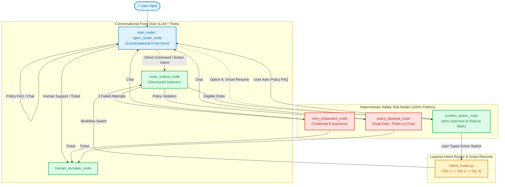

# Walkthrough: Unified Conversational Architecture with Smart Resume & Deterministic Safety

We have transformed the customer support agent from a legacy IVR-style menu into an open conversational assistant with 3-tier intent routing, zero-cost fast paths, Option A Smart Resume, and 100% deterministic safety sub-nodes.

---

## 🏛️ Architecture Overview

---

## 🚀 Key Changes Implemented

### 1. Unified Conversational Front Door (`start_node` / `open_router_node`)
- **Legacy removal**: Removed separate `entry_node` and `faq_node`. The graph now boots into an authentic, open conversational assistant:
  > `**Hi! How can I help you today?**`
  > `*(You can ask about our store policies, track your orders, or request a return/cancellation)*`
- **Zero-cost fast path**: Detects explicit direct commands like `"cancel ORD-15"` or single keywords (`"cancel"`, `"return"`) in **0ms** without invoking the LLM.
- **LLM tool calling**: Answers store policy FAQs citing document sections and performs scoped live order lookups via `make_tools(user_id)`.

### 2. Layered Intent Router (`src/customer_support_ai_agent/intent_router.py`)
- **Tier 1 — Expected Inputs (0ms, $0 cost)**:
  `validate_expected_input()` checks button choices (`"yes"`, `"no"`, `"1"`, `"all"`, or order IDs).
- **Tier 2 — Keyword & Regex Patterns (0ms, $0 cost)**:
  Detects deliberate workflow switches (`cancel` ↔ `return` ↔ `human`) or policy questions (`"how long"`, `"policy"`, `"?"`).
- **Tier 3 — Structured LLM Classifier Fallback**:
  Only invoked if free-text input is ambiguous.
- **Centralized State Cleanup (`clear_flow_state`)**:
  Wipes flow-local state (`customer_details`, `retry_count`, `confirmed`, `policy_block_reason`) to eliminate data contamination while preserving session identity.

### 3. Option A: Smart Resume (`resume_node`)
- When a user is in the middle of item selection or confirmation and asks a read-only question (e.g. *"How long does the refund take?"*):
  1. The node sets `resume_node = "confirm_action_node"` and sends `faq_prompt`.
  2. `open_router_node` answers the policy question conversationally.
  3. Control immediately resumes `confirm_action_node` without losing selected items or in-flight progress.
  4. The resumed interrupt prepends `💡 Policy Info: <answer>` to the prompt for seamless context continuity.

### 4. Deterministic Python Safety Sub-Nodes
- **All money and database mutations remain 100% deterministic**:
  - `order_lookup_node`: Strict customer ownership and status verification.
  - `retry_exhausted_node`: 3-attempt ceiling with direct dual exits (Ticket vs Chat).
  - `policy_blocked_node`: Strict 7-day return window validation with dual exits.
  - `confirm_action_node`: Server-side authoritative refund calculation based on unit prices and item quantities.

---

## 🧪 Verification & Automated Test Results

Executed the test suite `scratch/test_unified_architecture.py` and backend verification `scratch/test_backend_turn.py`:

| Test Case | Scenario Tested | Observed Result | Status |
| :--- | :--- | :--- | :---: |
| **Test 1** | Cold Start Open Conversation | Zero options shown; answers `"What is the return window for laptop backpacks?"` citing strict 7-day policy | ✅ **PASSED** |
| **Test 2** | Direct Command (`"cancel ORD-15"`) | Fast path extracts `order_id=15` and routes directly into cancellation flow | ✅ **PASSED** |
| **Test 3** | Mid-Flow Intent Switch | User switches from Cancel to `"actually I want to return order ORD-12"`; flow-local state cleaned and workflow seamlessly replaced | ✅ **PASSED** |
| **Test 4** | Option A: Smart Resume | User asks *"How long does the refund take?"* mid-confirmation; FAQ is answered and confirmation node resumes with order & items intact | ✅ **PASSED** |
| **Test 5** | 3-Attempt Retry Exhaustion | 3 invalid order IDs route deterministically to `retry_exhausted_node` offering Ticket or Chat | ✅ **PASSED** |
| **Backend Turn Test** | `execute_agent_turn()` Compatibility | Full frontend contract (`thread_id`, `options`, `status`, `messages`, `ui_data`) verified for FastAPI and Streamlit | ✅ **PASSED** |

---

## 📂 Modified & Created Files
- [src/customer_support_ai_agent/state.py](file:///d:/Customer-Support-AI-Agent/src/customer_support_ai_agent/state.py): Added `resume_node: Optional[str]`.
- [src/customer_support_ai_agent/intent_router.py](file:///d:/Customer-Support-AI-Agent/src/customer_support_ai_agent/intent_router.py): `validate_expected_input()`, `detect_intent_switch()`, and `clear_flow_state()`.
- [src/customer_support_ai_agent/routes.py](file:///d:/Customer-Support-AI-Agent/src/customer_support_ai_agent/routes.py): Updated `route_open_router`, `route_order_lookup`, and `route_confirm_action`.
- [src/customer_support_ai_agent/nodes.py](file:///d:/Customer-Support-AI-Agent/src/customer_support_ai_agent/nodes.py): Replaced legacy IVR menu with `open_router_node` and integrated Smart Resume.
- [src/customer_support_ai_agent/graph.py](file:///d:/Customer-Support-AI-Agent/src/customer_support_ai_agent/graph.py): Compiled unified graph with all alias edges.
